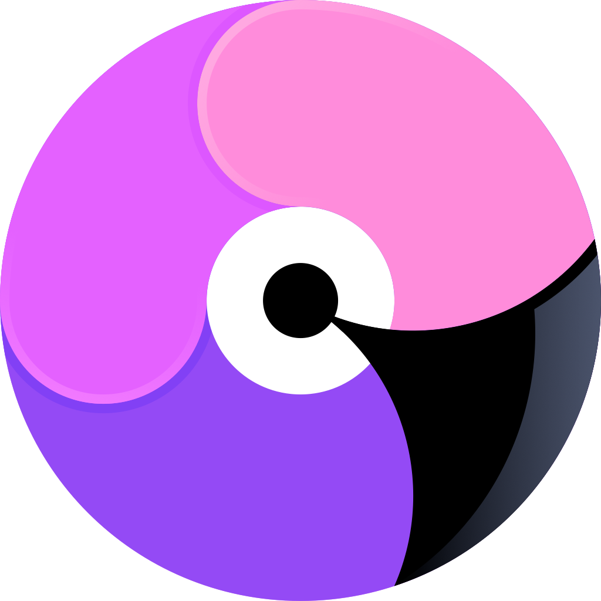

  

# Parrot

### **Fast, free, private dictation.**

Press a shortcut. Say what you want. Parrot turns your voice into clean text and pastes it.

---

## Why Parrot?

- **100% Free** — No trial gate, paid tier, weekly allowance, or surprise upgrade path.
- **100% Private** — Everything (audio, transcripts, dictionary, etc) stays on your machine.
- **No word limits** — Dictate as much as you want, whenever you want, without caps.
- **No subscription** — No monthly plan, Pro upgrade, or lifetime upsell.
- **100+ languages** — Auto-detect language or choose a specific language or locale.
- **Smart cleanup** — Adds punctuation, capitalization, spacing, and light corrections.
- **Personal dictionary** — Save names, acronyms, product terms, and project phrases for better recognition.
- **Open source** — Inspect, build, fork, package, or contribute to the code.

## Comparison

| Feature             | **Parrot** |    **Wispr Flow**    |     **Typeless**     |     **Monologue**     |     **SuperWhisper**     |      **Willow**      |
| ------------------- | :--------: | :------------------: | :------------------: | :-------------------: | :----------------------: | :------------------: |
| **Free**            |     ✅     | ⚠️ Limited free tier | ⚠️ Limited free tier | ⚠️ Limited free words |            ✅            | ⚠️ Limited free tier |
| **Private**         |     ✅     |    ⚠️ Cloud-first    | ⚠️ Cloud processing  |  ⚠️ Cloud processing  |            ✅            | ⚠️ Cloud processing  |
| **No word limits**  |     ✅     |     ❌ Paid only     |     ❌ Paid only     |     ❌ Paid only      |            ✅            |     ❌ Paid only     |
| **No subscription** |     ✅     |    ❌ Paid plans     |    ❌ Paid plans     |     ❌ Paid plans     | ⚠️ Paid plans + lifetime |    ❌ Paid plans     |
| **Open source**     |     ✅     |    ❌ Proprietary    |    ❌ Proprietary    |    ❌ Proprietary     |      ❌ Proprietary      |    ❌ Proprietary    |

## Under the hood

Parrot uses:

- **WhisperKit** and **whisper.cpp** for speech-to-text.
- **llama.cpp** with small GGUF models for cleanup and formatting.
- **Tauri** for the desktop app shell.

## Roadmap 🗺️

- [x] macOS
- [ ] Windows
- [ ] Linux

## License

MIT. See [LICENSE](LICENSE), [THIRD_PARTY_LICENSES.md](THIRD_PARTY_LICENSES.md), and [PRIVACY.md](PRIVACY.md).
