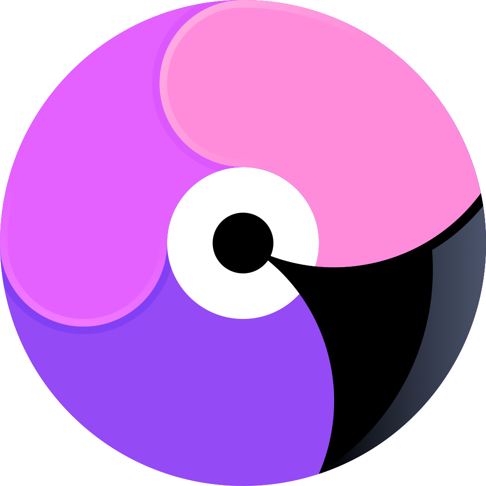

  

# Parrot

### **Fast, free, private dictation.**

Press a shortcut. Say what you want. Parrot turns your voice into clean text and pastes it.

---

## What is Parrot?

Parrot is a local-first dictation app for macOS and Windows. It records your voice, transcribes it locally, cleans up the text, and pastes it into the app you were using.

## Why Parrot?

- **Free and open source**
- **Local-first and private**
- **No subscriptions or word limits**
- **Works across 100+ languages**
- **Smart cleanup and punctuation**
- **Personal dictionary for names, acronyms, and project terms**

## Comparison

| Feature             | **Parrot** |    **Wispr Flow**    |     **Typeless**     |     **Monologue**     |     **SuperWhisper**     |      **Willow**      |
| ------------------- | :--------: | :------------------: | :------------------: | :-------------------: | :----------------------: | :------------------: |
| **Free**            |     ✅     | ⚠️ Limited free tier | ⚠️ Limited free tier | ⚠️ Limited free words |            ✅            | ⚠️ Limited free tier |
| **Private**         |     ✅     |    ⚠️ Cloud-first    | ⚠️ Cloud processing  |  ⚠️ Cloud processing  |            ✅            | ⚠️ Cloud processing  |
| **No word limits**  |     ✅     |     ❌ Paid only     |     ❌ Paid only     |     ❌ Paid only      |            ✅            |     ❌ Paid only     |
| **No subscription** |     ✅     |    ❌ Paid plans     |    ❌ Paid plans     |     ❌ Paid plans     | ⚠️ Paid plans + lifetime |    ❌ Paid plans     |
| **Open source**     |     ✅     |    ❌ Proprietary    |    ❌ Proprietary    |    ❌ Proprietary     |      ❌ Proprietary      |    ❌ Proprietary    |

## Under the hood

Parrot uses:

- **WhisperKit** and **whisper.cpp** for speech-to-text.
- **llama.cpp** with local GGUF models for cleanup and formatting.
- **Tauri**, **Rust**, **Swift**, and **TypeScript** for the desktop app.

## Roadmap 🗺️

- [x] macOS
- [x] Windows
- [ ] Linux

## Links

- [Privacy Notice](PRIVACY.md)
- [Contributing](CONTRIBUTING.md)
- [Native Core](native-core/README.md)
- [License](LICENSE)
- [Third-party licenses](THIRD_PARTY_LICENSES.md)
